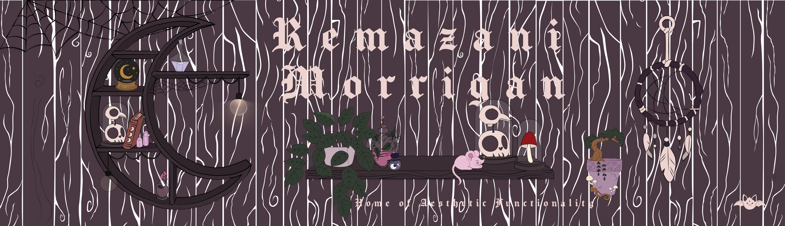

  

  <!-- The Visual & Interaction Masterclass -->
  
  
  
  
  
  
   <!-- The Core Architecture & Data Engine -->
  
  
  

<picture>
  <source media="(prefers-color-scheme: dark)" srcset="https://github.com/remilkies/remilkies/raw/output/github-snake-dark.svg?sanitize=true&kill_cache=3" />
  <source media="(prefers-color-scheme: light)" srcset="https://github.com/remilkies/remilkies/raw/output/github-snake.svg?sanitize=true&kill_cache=3" />
  
</picture>

